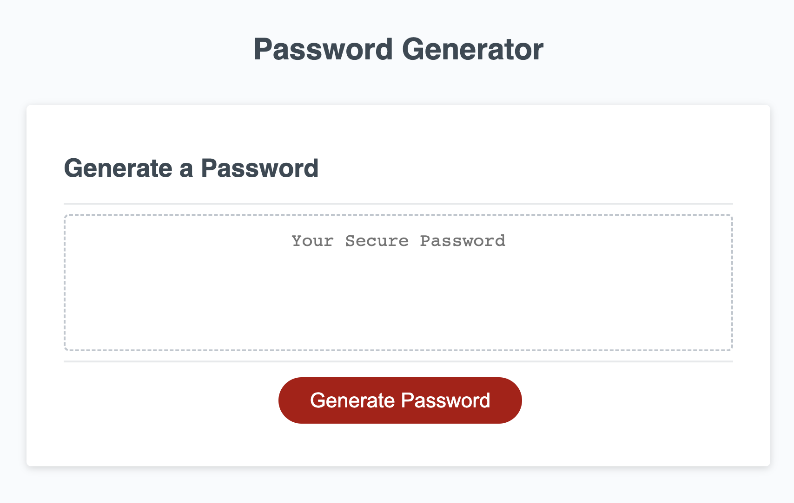
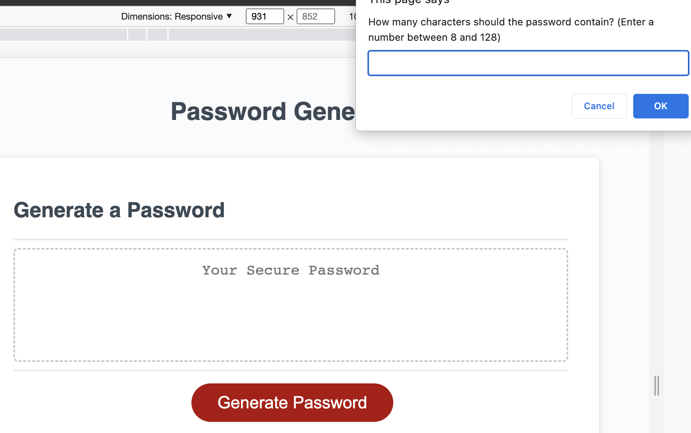
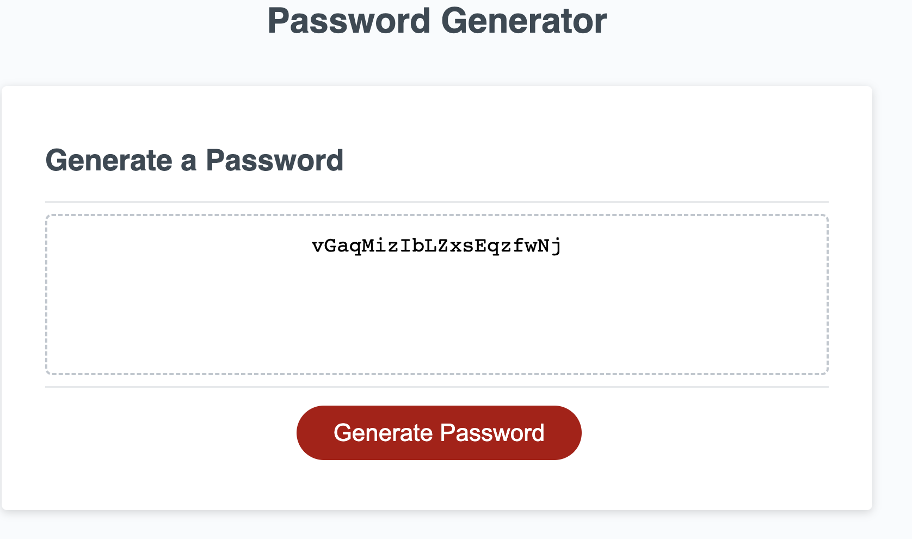

# Passcode Generator_TG
____
## Acceptance Criteria

```
GIVEN I need a new, secure password
WHEN I click the button to generate a password
THEN I am presented with a series of prompts for password criteria
WHEN prompted for password criteria
THEN I select which criteria to include in the password
WHEN prompted for the length of the password
THEN I choose a length of at least 8 characters and no more than 128 characters
WHEN asked for character types to include in the password
THEN I confirm whether or not to include lowercase, uppercase, numeric, and/or special characters
WHEN I answer each prompt
THEN my input should be validated and at least one character type should be selected
WHEN all prompts are answered
THEN a password is generated that matches the selected criteria
WHEN the password is generated
THEN the password is either displayed in an alert or written to the page
```

   

### Live URL
    Http:

### Portfolio Homepage Preview
* Basic Interface
    

* Prompt alert
    

* Result
    

### About
Based on the criteria, these things has been changed:
* Prompts pop up after clicking the button to generate a password
* User could choice the length of the pass word they want, also, if the password contain `lowercase`, `uppercase`, `number` or `special characters`.
* After all the confrimation, all the inputs should be validated.
* Then the password will be generated.
* The password will be written to the page.

### Contributor
* jamierachael - Github

* Paul Keldsen - Youtube


